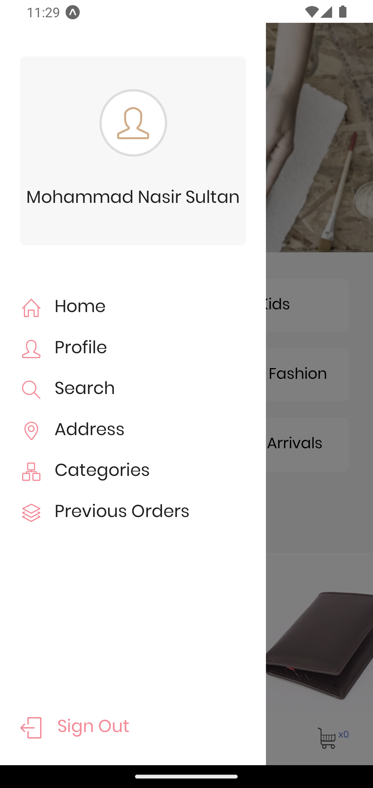
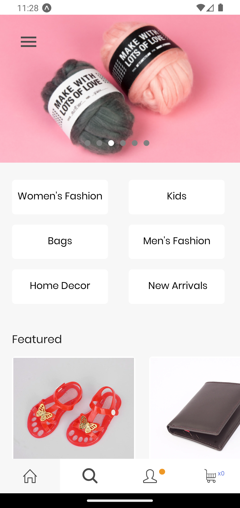
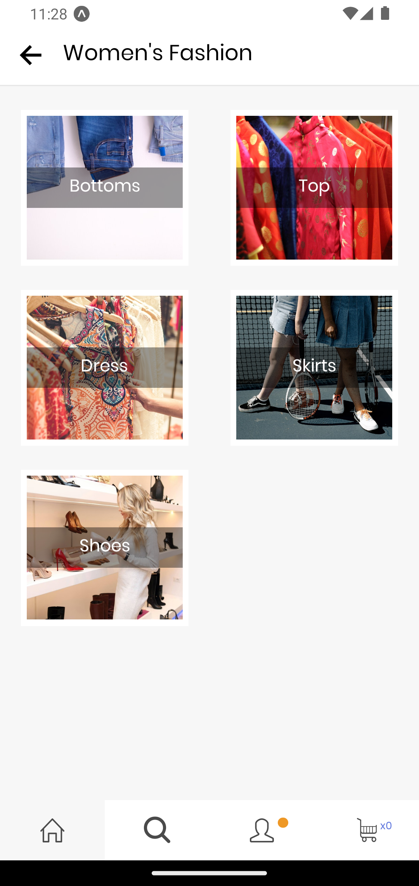
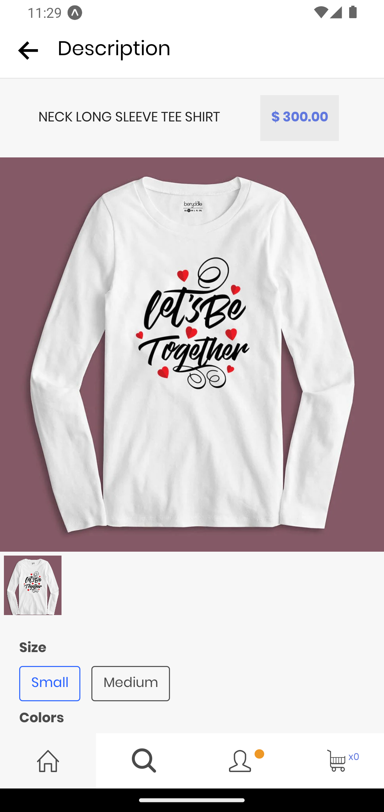
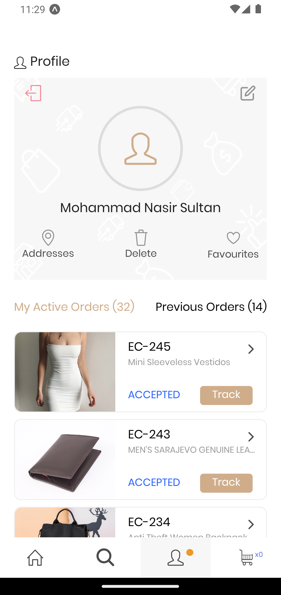
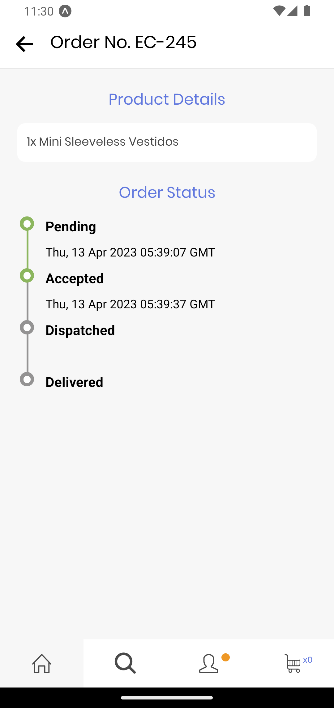
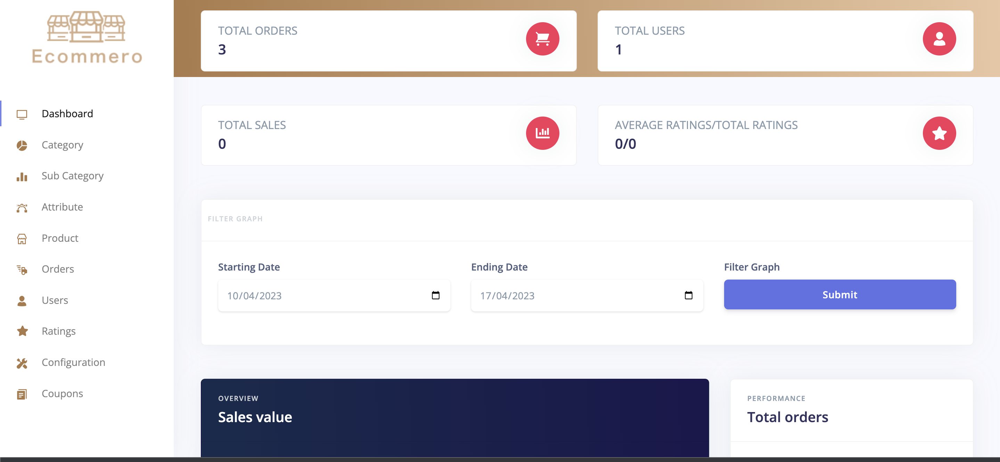
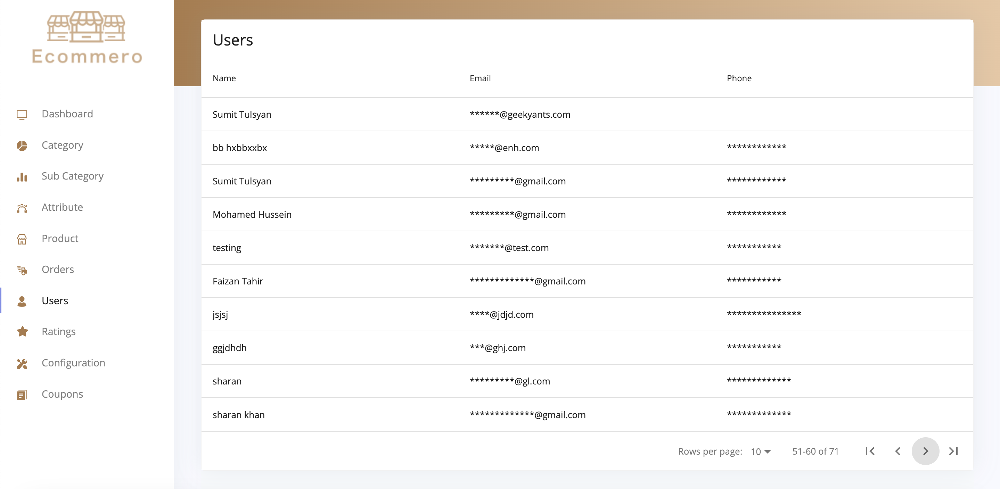
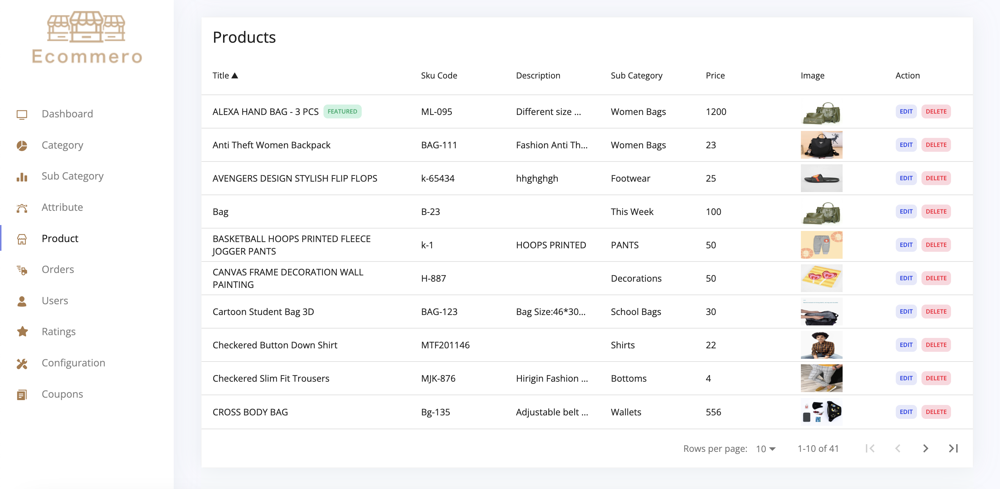
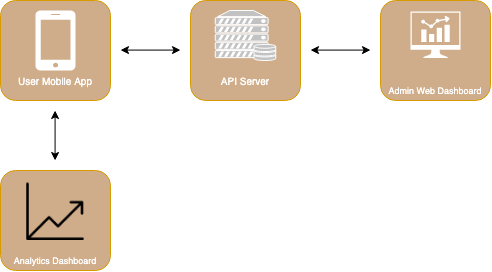

# Ecommero Mobile

 
 <b>Introducing Ecommero</b>, the comprehensive e-commerce solution that caters to iOS, Android, and Web platforms. With a modern design and full-fledged features, Ecommero provides an easy-to-implement app solution for any e-commerce company.

Built with React Native and Expo for mobile, and React for the dashboard panel, Ecommero provides seamless integration with any e-commerce platform. State management and querying endpoints are made simple with Apollo Client, while the API is built with Node and Mongodb.

Ecommero provides all the necessary features to optimize your e-commerce business. Push notifications for both mobile and web platforms keep your customers engaged and informed, while the analytics dashboard for mobile app allows you to track customer behavior and optimize your app accordingly. Payment integration with PayPal, credit and debit cards ensures a seamless and secure transaction process, while the order tracking feature provides customers with real-time information on their order status, enhancing their shopping experience.

Email integration ensures that customers receive order confirmation and shipping updates, while rating and review features provide valuable feedback to improve your business. GPS integration makes it easy for customers to find their address, while Facebook and Google authentication provide a seamless login experience.

The mobile-responsive dashboard simplifies e-commerce management, while the multiple product variation items feature enables you to display and sell different versions of the same product.

Overall, Ecommero is a complete and customizable solution for any e-commerce business. With its robust features, modern design, and seamless integration, Ecommero is the ideal app for optimizing your e-commerce platform.

- Supported iOS versions: 11+
- Supported Android versions: 6.0+

<b>This is the full free source code of our solution, however the backend and API is proprietary and can be obtained via paid license.</b>

## What is included:

Ecommero offers a comprehensive e-commerce solution with two distinct modules: the admin panel and the Ecommero app.

- The admin panel lets you manage orders, track sales, and handle customer accounts efficiently. It's your command center for complete control over your e-commerce business.

- The Ecommero app provides a user-friendly platform for customers to customize and place their orders with ease. With a vast selection of products to choose from, customers can customize their orders to their liking, ensuring a hassle-free shopping experience.

## Features:

It has all the features that you will ever need to implement this application for any e-commerce company. Some of the features that are included in it are:

- Analytics dashboard for the mobile app
- Payment integration with Paypal and Stripe
- Order tracking feature
- Email Integration e.g for order confirmation etc.
- Ability to provide ratings and reviews
- Finding address using GPS integration
- Facebook and Google authentication integration
- Mobile Responsive Dashboard
- Multiple product variation items
- Push notifications for both mobile and web

## Setup

As we’ve mentioned above, the solution includes three separate modules. To setup these modules, follow the steps below:

To run the module, you need to have nodejs installed on your machine. Once nodejs is installed, go to the directory and enter the following commands

-      cd ecommero-app
-      npm install (or yarn install)
-      npm start

The required credentials and keys have been set already. You can setup your own keys and credentials

The version of nodejs should be between 14.0 to 16.0

## Run Grocery UI in your Device:

#### 1. Run on iOS

- Run -expo start- in your terminal
- An expo interface will open select the option run on iOS simulator
- To run on iOS device enter the url of expo given in opened interface in your expo app on iOS by downloading expo from AppStore

#### 2. Run on Android

- Run expo start in your terminal
- Make sure you have an Android emulator installed and running
- Click the option run on android emulator in the opened interface in your expo app
- To run on device scan the QR code given in opened expo app web interface

## Screenshots

|                     Ecommero Menu                     |                  Ecommero Categories                  |                    Ecommero Items                     |
| :---------------------------------------------------: | :---------------------------------------------------: | :---------------------------------------------------: |
|  |  |  |

|               Ecommero Items Details               |               Ecommero User Account                |                    Track Order                     |
| :------------------------------------------------: | :------------------------------------------------: | :------------------------------------------------: |
|  |  |  |

|                 Stats Overview                 |                   User Table                   |                Products Editing                |
| :--------------------------------------------: | :--------------------------------------------: | :--------------------------------------------: |
|  |  |  |

## High Level Architecture

- User Mobile App communicates with both API Server and analytics dashboard
- Web dashboard communicates with only API Server

### Prerequisites:

##### App Ids for Mobile App in app.json

- Facebook Scheme
- Facebook App Id
- Facebook Display Name
- iOS Client Id Google
- Android Id Google
- Amplitude Api Key
- server url

##### Set credentials in API in file helpers/config.js and helpers/credentials.js

- Email User Name
- Password For Email
- Mongo User
- Mongo Password
- Mongo DB Name
- Reset Password Link
- Admin User name
- Admin Password
- User Id
- Name

##### Set credentials in Admin Dashboard in file src/index.js

- Firebase Api Key
- Auth Domain
- Database Url
- Project Id
- Storage Buck
- Messaging Sender Id
- App Id

##### NOTE: Email provider has been only been tested for gmail accounts

## Technologies:

- [Expo](https://expo.dev/)
- [React Navigation](https://reactnavigation.org/)
- [Apollo GraphQL](https://www.apollographql.com/)
- [ReactJS](https://reactjs.org/)
- [NodeJS](https://nodejs.org/en/)
- [MongoDB](https://www.mongodb.com/)
- [Firebase](https://firebase.google.com/)
- [Amplitude](https://amplitude.com/)
- [React Native](https://reactnative.dev/)
- [React Router](https://reactrouter.com/)
- [GraphQL](https://graphql.org/)
- [ExpressJS](https://expressjs.com/)
- [React Strap](https://reactstrap.github.io/)
